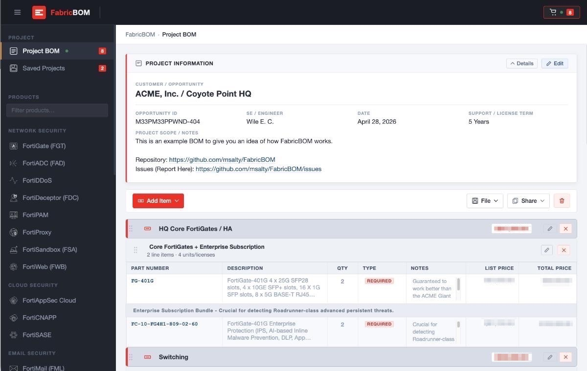

# FabricBOM

**Cross-product Bill of Materials generator for Fortinet Security Fabric deployments**

   



---

## Overview

FabricBOM is a client-side web application for building and exporting structured Bill of Materials quotes for Fortinet network security deployments. Select from 30+ supported products across eight solution categories, configure hardware models, support tiers, and add-on licenses, then assemble everything into a single exportable Project BOM — no backend, no installation, no internet connection required.

Designed to be run entirely offline. Install it as a web app on most modern browsers, iOS, or Android for convenient repeat access.

> **Disclaimer:** FabricBOM is not an officially sanctioned Fortinet product. Always validate output against official Fortinet product ordering guides. All source and reference materials are public.

---

## Features

### Building a BOM
- **30+ product configurators** — dedicated per-product pages organized in a sidebar by solution category
- **Per-product configuration** — select hardware model, quantity, FortiCare support tier, and product-specific add-on licenses
- **Custom section headers** — insert labeled group dividers (e.g., "Core Firewall", "Option A – SD-WAN") with optional notes to organize complex quotes
- **Item classification** — tag line items as REQUIRED, OPTIONAL, or EXCLUDED; items without pricing auto-flag as ATTENTION
- **Inline editing** — edit quantities, notes, group labels, and item types directly in the BOM table
- **Drag-to-reorder** — drag product groups and line items into any order
- **Custom SKU entry** — look up any part number via catalog search or enter it manually

### Project Management
- **Named project saves** — save multiple projects to browser storage by name and reopen them any time
- **Version history** — each project retains previous saves; restore any prior version with one click
- **Session persistence** — IndexedDB keeps your active BOM intact across page refreshes
- **Project metadata** — capture customer/opportunity name, opportunity ID, SE name, date, and project scope notes

### Pricing
- **Price list upload** — drag-and-drop a Fortinet CSV or XLSX price list to apply pricing across all BOM items
- **Auto-applied pricing** — matched prices appear inline; SKUs with no price match are flagged automatically
- **Group pricing totals** — optionally display a subtotal on each group header

### Export & Sharing
- **Export as CSV** — flat export with resolved term suffixes applied to all SKUs
- **Export as XLSX** — formatted Excel workbook via the bundled SheetJS library
- **Export as .fbom file** — the native FabricBOM format for saving and sharing a full project
- **Import .fbom** — reload any previously exported project file to continue editing
- **Share URL** — generate a compressed URL containing the full BOM; recipients open it directly in their browser
- **Print view** — browser-native print layout optimized for customer-ready output
- **Global license term** — apply 1-year, 3-year, 5-year, or co-term suffixes to all SKUs at export time

### Security & Privacy
- **Read-Only mode** — lock a BOM against accidental edits; toggle with a single checkbox
- **Password protection** — optionally require a password to unlock; encrypts the Customer, Opportunity ID, and Project Scope fields in all exports so recipients without the password cannot view sensitive deal details
- **Fully local** — all data (projects, pricing, BOM state) is stored in your browser's IndexedDB and never transmitted to any server

### App & Accessibility
- **Progressive Web App** — installable on desktop, iOS, and Android; works fully offline via service worker
- **Sidebar product search** — filter the 30+ product list by name in real time
- **Responsive layout** — mobile-optimized with a slide-in sidebar and expandable row details
- **Help & FAQ** — built-in documentation page with animated GIF walkthroughs
- **Dependency-free runtime** — plain HTML, CSS, and JavaScript; no build step, no npm, no frameworks

---

## Supported Products

| Category | Products |
|---|---|
| Network Security | FortiGate (FGT), FortiADC (FAD), FortiDDoS, FortiDeceptor (FDC), FortiPAM, FortiProxy, FortiSandbox (FSA), FortiWeb (FWB) |
| Cloud Security | FortiAppSec Cloud, FortiCNAPP, FortiSASE |
| Email Security | FortiMail (FML), FortiMail Workspace |
| Network Access | FortiAP (FAP), FortiExtender (FEX), FortiPresence, FortiSwitch (FSW) |
| Endpoint Security | FortiClient (FCT), FortiDLP, FortiEDR |
| Access Control | FortiAuthenticator (FAC), FortiNAC |
| Management | FortiAnalyzer (FAZ), FortiAIOps, FortiManager (FMG), FortiMonitor, FortiRecon, FortiSIEM, FortiSOAR |
| Licensing | FortiFlex |
| Catalog Search | Search & Custom Entry |

---

## Getting Started

**Requirements:** Any modern web browser. No installation, build step, or internet connection needed.

**Open locally:**

```bash
# Option 1 — open directly in your browser
open index.html

# Option 2 — serve with any static file server
npx serve .
python3 -m http.server 8080
```

**Basic workflow:**

1. Select a product from the sidebar (use the search box to filter quickly)
2. Configure the hardware model, quantity, support tier, and any add-on licenses
3. Click **Add to Project BOM**
4. Repeat for each product; add group headers to separate sections
5. Fill in project metadata (customer name, opportunity ID, SE, date, scope)
6. Optionally upload a Fortinet price list to show pricing
7. Select the license term and export as CSV, XLSX, or print

---

## Architecture

FabricBOM is intentionally dependency-free — everything runs in the browser with plain HTML, CSS, and JavaScript.

```
FabricBOM/
├── index.html              # Main hub: sidebar, project metadata, BOM cart
├── sw.js                   # Service worker for offline PWA support
├── manifest.json           # PWA manifest
├── products/               # Self-contained per-product configurators (30+)
│   ├── fortigate-bomgen.html
│   ├── fortiswitch-bomgen.html
│   ├── custom-sku-bomgen.html
│   └── ...
├── docs/
│   ├── help-faq.html       # Built-in help documentation
│   └── screenshots/
├── forti-icons/            # SVG product icons
└── js/
    └── xlsx.mini.min.js    # Bundled SheetJS for Excel export
```

- **`index.html`** hosts the sidebar navigation, project metadata form, BOM cart, saved projects manager, and all export/share/import logic
- **`products/*.html`** are embedded as iframes; each is a standalone product configurator
- **PostMessage API** carries BOM line-item data from product iframes to the parent hub
- **IndexedDB** stores saved projects, version history, and uploaded price lists — all local, all private
- **LZString compression** encodes BOM state into shareable URLs without any server involvement
- **SKU convention** — internal SKUs use a `-DD` placeholder; the hub substitutes the correct term suffix (`-12`, `-36`, `-60`) at export time

---

## License

[MIT](LICENSE) — 2026 msalty
